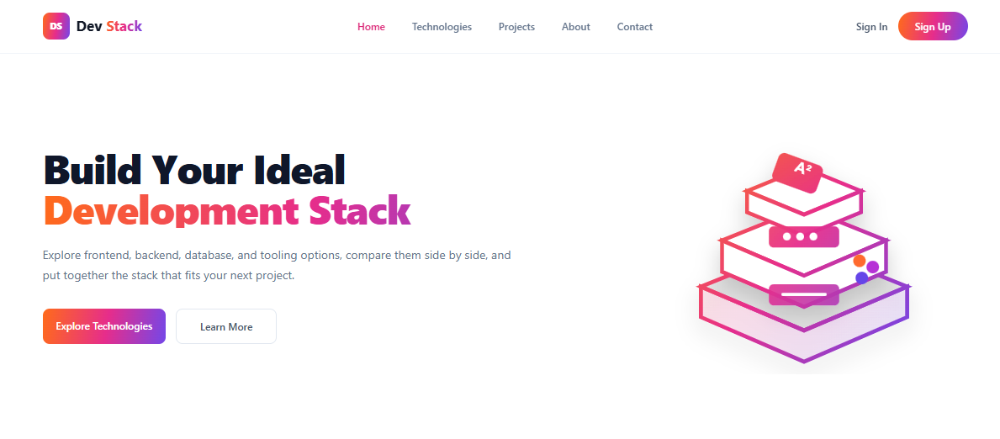
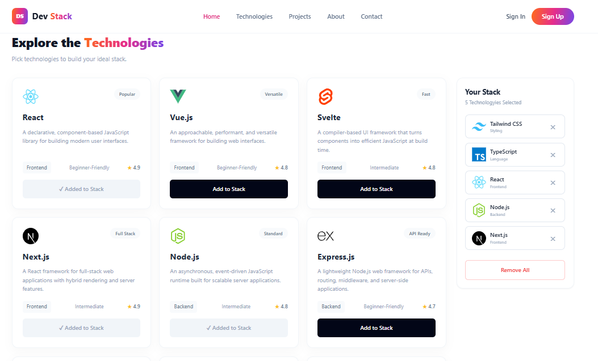
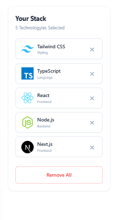
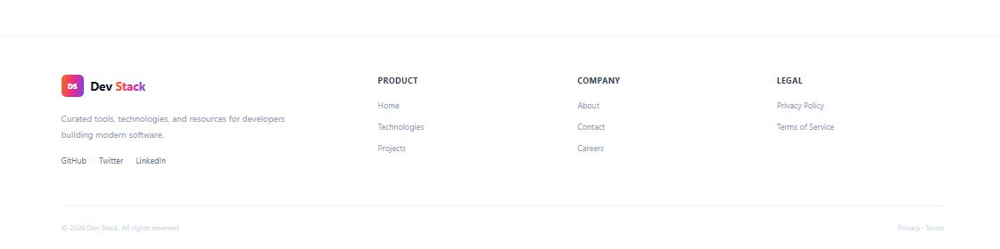

# Dev Stack Assignment-5

A responsive React project that lets users explore modern development technologies and build a personal technology stack.

## 🚀 Features
- Responsive sticky navbar with a mobile hamburger menu.
- Technology cards loaded dynamically from a local JSON file.
- Add, remove, duplicate-prevention, and Remove All stack functionality with React Toastify notifications.

## 🛠️ Technologies Used
- React.js
- Vite
- Tailwind CSS
- JavaScript (ES6+)
- React-Toastify
- JSON

## 📂 Project Structure
```
dev-stack/
├── index.html
├── package.json
├── package-lock.json
├── vite.config.js
├── tailwind.config.js
├── README.md
├── public/
│   └── technologies.json
└── src/
    ├── assets/
    │   └── hero-illustration.svg
    │   └── images/
    │       ├── Screenshot-1.png
    │       ├── Screenshot-2.png
    │       ├── Screenshot-3.png
    │       └── Screenshot-4.png
    ├── components/
    │   ├── Navbar.jsx
    │   ├── Hero.jsx
    │   ├── TechnologyCard.jsx
    │   ├── TechnologySection.jsx
    │   ├── StackSidebar.jsx
    │   └── Footer.jsx
    ├── data/
    ├── App.jsx
    ├── main.jsx
    └── index.css
```

<h2>📸 Project Screenshots</h2>

<table> 
  <tr> 
    <td align="center" valign="top"> 
      <b>Nav and Banner Section</b><br><br> 
       
    </td> 
    <td align="center" valign="top"> 
      <b>Technologies Card Section</b><br><br> 
       
    </td> 
    <td align="center" valign="top"> 
      <b>Stack Sidebar Card</b><br><br> 
       
    </td> 
    <td align="center" valign="top"> 
      <b>Footer Section</b><br><br> 
       
    </td> 
  </tr> 
</table>

### I have written a concise, simple, and amazing answer to this question about React :
### 1. What is JSX, and why is it used in React?

JSX is a syntax that lets us write HTML-like UI inside JavaScript. React uses it to make component markup easier to read and maintain.

### 2. What is the difference between props and state?

Props are data passed into a component by its parent. State is data managed inside a component that can change and trigger a re-render.

### 3. What does the `useState` hook do, and where did you use it?

`useState` creates component state and gives us a function to update it. This project uses it for the technology list, selected stack, loading state, and mobile menu.

### 4. What does the `useEffect` hook do, and why did you need it to load the JSON data?

`useEffect` runs side effects after rendering. It is used here to fetch `/technologies.json` when the technology section loads.

### 5. Why does every item in a `.map()` list need a unique `key` prop?

React uses the key to identify each item between renders. A stable unique key helps React update the correct element efficiently.

### 6. What is conditional rendering? Show one place you used it.

Conditional rendering means showing different UI based on a condition. The stack sidebar shows `Your stack is empty.` when `stack.length === 0`; otherwise it displays selected technologies.

### 7. How do you pass data from a parent component to a child component, and how does a child send something back to the parent?

A parent passes data through props. A child can send information back by calling a callback function that the parent passes as a prop. For example, `TechnologyCard` receives `tech` and `onAdd`, then calls `onAdd(tech)`.

 ## 📁 Data Source

Technology data lives in `public/technologies.json` and is fetched at runtime. The technology array is intentionally not hardcoded inside a React component.

## 🎨 Theme

The orange → pink → violet gradient is defined once as `--brand-gradient` in `src/index.css`, so the main brand theme can be changed from one place.
  
## 🌐 Live Demo

https://mdnayeemislam6466.github.io/Dev-Stack/

## 👨‍💻 Author


**Md Nayeem**  
💻 Web Developer  
📍 Bangladesh  

<br clear="left">
